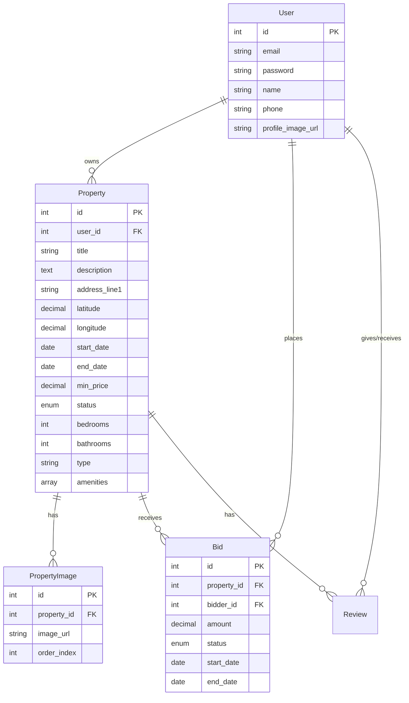

## Models

### User
Core entity representing platform users who can own properties and place bids.

#### Fields
| Field | Type | Description |
|-------|------|-------------|
| id | INTEGER | Primary Key, Auto-increment |
| email | STRING | User's email address |
| password | STRING | Encrypted password |
| name | STRING | User's full name |
| phone | STRING | Contact number |
| profile_image_url | STRING | URL to profile image |

#### Relationships
- **Properties** (One-to-Many)
  - User has many Properties as owner
  - Foreign key: `user_id` in Properties table
- **Bids** (One-to-Many)
  - User has many Bids as bidder
  - Foreign key: `bidder_id` in Bids table
- **Reviews** (One-to-Many, Bidirectional)
  - Given Reviews: User has many Reviews as reviewer
  - Received Reviews: User has many Reviews as reviewed
  - Foreign keys: `reviewer_id` and `reviewed_id` in Reviews table

### Property
Represents listings available for bidding.

#### Fields
| Field | Type | Constraints | Description |
|-------|------|-------------|-------------|
| id | INTEGER | PK, Auto-increment | Primary identifier |
| user_id | INTEGER | FK, Not null | Reference to owner (Users table) |
| title | STRING | Not null | Property listing title |
| description | TEXT | | Detailed property description |
| address_line1 | STRING | Not null | Primary address line |
| address_line2 | STRING | | Secondary address line |
| city | STRING | Not null | City name |
| state | STRING | Not null | State name |
| zip_code | STRING | Not null | Postal code |
| formatted_address | STRING | Not null | Complete formatted address |
| latitude | DECIMAL(10,8) | Not null, -90 to 90 | Geographic coordinate |
| longitude | DECIMAL(11,8) | Not null, -180 to 180 | Geographic coordinate |
| place_id | STRING | | Google Places ID reference |
| start_date | DATE | Not null | Listing start date |
| end_date | DATE | Not null | Listing end date |
| min_price | DECIMAL(10,2) | Not null, Min: 0 | Minimum acceptable bid |
| status | ENUM | Default: 'active' | Options: active, ended, rented |
| auction_end_date | DATE | | Auction closing date |
| bedrooms | INTEGER | Default: 0 | Number of bedrooms |
| bathrooms | INTEGER | Default: 0 | Number of bathrooms |
| type | STRING | | Property type (e.g., Apartment) |
| amenities | ARRAY[STRING] | Default: [] | List of available amenities |
| created_at | DATE | Default: NOW | Record creation timestamp |
| updated_at | DATE | | Last update timestamp |
| deleted_at | DATE | | Soft delete timestamp |

#### Configuration
- Implements soft delete (paranoid: true)
- Maintains created_at, updated_at timestamps

#### Relationships
- **Owner** (Many-to-One)
  - Belongs to User
  - Foreign key: `user_id`
- **Images** (One-to-Many)
  - Has many PropertyImages
  - Foreign key: `property_id` in PropertyImages table
- **Bids** (One-to-Many)
  - Has many Bids
  - Foreign key: `property_id` in Bids table
- **Reviews** (One-to-Many)
  - Has many Reviews
  - Foreign key: `property_id` in Reviews table

### Bid
Records of bids placed on properties.

#### Fields
| Field | Type | Constraints | Description |
|-------|------|-------------|-------------|
| id | INTEGER | PK, Auto-increment | Primary identifier |
| property_id | INTEGER | FK, Not null | Reference to Property |
| bidder_id | INTEGER | FK, Not null | Reference to bidding User |
| amount | DECIMAL(10,2) | Not null, Min: 0 | Bid amount |
| status | ENUM | Default: 'active' | Options: active, withdrawn, won |
| start_date | DATE | Not null | Bid validity start |
| end_date | DATE | Not null | Bid validity end |
| created_at | DATE | Default: NOW | Record creation timestamp |
| updated_at | DATE | | Last update timestamp |

#### Relationships
- **Property** (Many-to-One)
  - Belongs to Property
  - Foreign key: `property_id`
- **Bidder** (Many-to-One)
  - Belongs to User
  - Foreign key: `bidder_id`

### PropertyImage
Manages images associated with property listings.

#### Fields
| Field | Type | Constraints | Description |
|-------|------|-------------|-------------|
| id | INTEGER | PK, Auto-increment | Primary identifier |
| property_id | INTEGER | FK, Not null | Reference to Property |
| image_url | STRING | Not null | URL to stored image |
| order_index | INTEGER | Default: 0 | Display order sequence |

#### Configuration
- Maintains created_at, updated_at timestamps

#### Relationships
- **Property** (Many-to-One)
  - Belongs to Property
  - Foreign key: `property_id`

## Database Diagram
